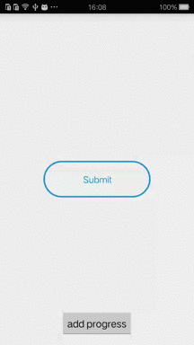

This is library project with a custom view that implements concept of Submit Button (<https://dribbble.com/shots/1426764-Submit-Button?list=likes&offset=3>) made by Colin Garven.  

###Demo###



###Usage###

``` xml
 <com.tuesda.submit.SubmitView
        android:layout_centerInParent="true"
        android:id="@+id/submit"
        android:layout_width="200dp"
        android:layout_height="200dp" />
```

``` xml
mSubmit.setOnProgressStart(new SubmitView.OnProgressStart() {
            @Override
            public void progressStart() {
                // do something when progress start
            }
        });
        
        mSubmit.setOnProgressDone(new SubmitView.OnProgressDone() {
            @Override
            public void progressDone() {
                // do something when progress is done
            }
        });
```

###public interface###

| 函数名 |  作用|
|:------|:-----|
|`setBackColor(int color)`| 设置图标背景色，默认是绿色(0xff00cd97)，上图Demo设置为蓝色(0xff0097cd)|
|setText(String str)|设置按钮名字，默认是`Submit`|
|reset()|将按钮重置到初始状态|
|setProgress(float progress)|设置正在执行工作的执行进程|
|isProgressDone()| 正在执行工作是否完成|
|setOnProgressStart(OnProgressStart listener)|设置progress开始回调|
|setOnProgressDone(OnProgressDone listener) | 设置progress完成回调|